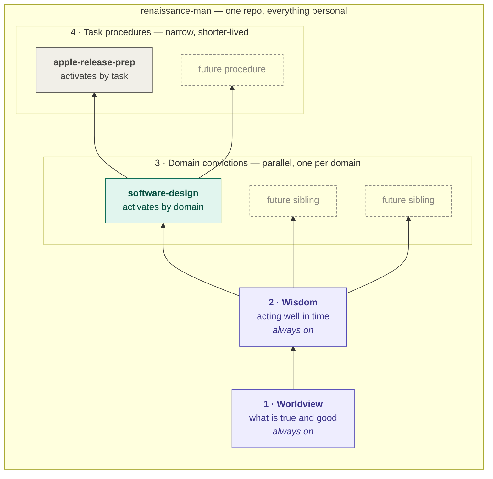

# renaissance-man

*A worldview for the imago ex machina.*

A [Claude Code](https://code.claude.com/docs/en/overview) plugin that gives Claude a layered formation rather than a single persona. The base layers are consulted at the start of substantive tasks — writing, code review, architecture, planning, advice — even when nothing philosophical is mentioned, and stay invisible by default: what you should notice is that the answer is better, not that a skill loaded.

This is also where all of my personal skills live, one repo rather than several. The layering below describes how a skill is *consulted*, not where it's kept.

The lower layers are serial. Each depends on the one below it and adds only what that layer can't supply on its own:

1. **Worldview** — what is true and what counts as good. Reformed and neo-Calvinist commitments about creation, humanity, knowledge, and work, held as a working map rather than a finished system: which tradeoffs are real, who bears the cost of a proposal, what a design assumes without arguing.
2. **Wisdom** — acting well in time, built on worldview rather than beside it. "The fear of the LORD is the beginning of wisdom" is a dependency declaration: the craft of timing, proportion, sequencing, and restraint presupposes the map underneath it. Draws on Proverbs and Ecclesiastes held in tension — prudence, and the limits of prudence.
3. **Domain convictions** — a parallel tier, one sibling per domain, starting with `software-design` (philosophy of software design, the first sibling built). Where layers 1–2 are universal and singular — exactly one worldview, always on — tier 3 fans out: a task activates the base plus whichever siblings its domain touches, never the whole set. Each sibling inherits the base's concepts and constitution without redefining them, and anything two siblings would both need gets pushed down into layers 1–2 instead of duplicated. The gate for a candidate sibling: would this still be true if I changed jobs? "How I judge software design" qualifies; "how Kubernetes works" doesn't.
4. **Task procedures** — the task-shaped tier, starting with `apple-release-prep` (reviewing a release-please PR for an Apple app and writing the App Store text for it). Where tier 3 holds convictions that survive a change of job, this tier holds procedure attached to a toolchain: it knows what release-please does to a changelog and what App Store Connect rejects. That makes it narrower and shorter-lived, and it activates only on an exact match — a release PR, a version bump, store listing copy — never as ambient formation.

The original plan stopped at tier 3, on the theory that anything task-shaped belonged in a per-project plugin. Keeping tiers 1–3 pure was worth less than having one repo to maintain, so tier 4 lives here too. The boundary is preserved by how the skills behave rather than by where they sit: the base is always on, tier 3 activates by domain, tier 4 activates by task.



Nothing here is decorative. It doesn't append theology to technical answers — it changes what counts as a good answer.

## What's inside

Four skills are built today: `worldview` (layer 1), `wisdom` (layer 2, depends on worldview), `software-design` (the first tier-3 sibling, stacked on both), and `apple-release-prep` (the first tier-4 procedure).

```
skills/
├── worldview/
│   ├── SKILL.md                     the operating layer
│   └── references/
│       ├── core-commitments.md      the position in full, with sources and live debates
│       ├── applied-judgment.md      worked before/after examples by domain
│       └── other-frames.md          reading other positions accurately
├── wisdom/
│   ├── SKILL.md                     the operating layer
│   └── references/
│       ├── proverbs-patterns.md     observed regularities: speech, counsel, diligence, planning, character, conflict
│       └── ecclesiastes-limits.md   the limits: hevel, time and season, enough, toil and gift, death as design constraint
├── software-design/                 tier-3 domain sibling — activates on design tasks, not always-on
│   ├── SKILL.md                     the operating layer; spine = fit the grain, but earn the structure
│   └── references/
│       ├── design-canon.md          the position in full: complexity, modules, abstraction, sources, live debates
│       └── design-in-practice.md    worked generic-vs-shaped examples: review, abstraction, boundary, data model, refactor
└── apple-release-prep/              tier-4 procedure — activates on a release PR or store listing, nothing else
    ├── SKILL.md                     review the release-please PR, then write the App Store submission packet
    ├── references/
    │   ├── app-baseline.md          the cached app profile: what it holds, how to build it, when to refresh
    │   ├── apple-release-checks.md  the Apple gates: build number, permissions, privacy manifest, migrations
    │   ├── investigating-commits.md reading a diff for user-visible behavior when the commit message won't say
    │   └── listing-voice.md         voice, field limits, localization, worked before/after examples
    └── scripts/
        ├── survey_app.sh            gather the raw material for the app profile
        ├── collect.sh               assemble the release review packet from the PR, commits, and version files
        ├── inspect_commit.sh        triage one commit or PR into what a person could notice
        └── check_limits.py          character-count the submission packet against App Store limits
```

## Installation

Add the [willswire marketplace](https://github.com/willswire/claude-plugins) and install the plugin from inside Claude Code:

```
/plugin marketplace add willswire/claude-plugins
/plugin install renaissance-man@willswire
```

Or, for local development, clone the repository and load it with the `--plugin-dir` flag:

```bash
git clone https://github.com/willswire/renaissance-man.git
claude --plugin-dir ./renaissance-man
```

Claude invokes these skills on its own when a task calls for it — `worldview` and `wisdom` on any substantive task, `software-design` when the work is about how software is structured, `apple-release-prep` when there's a release PR or App Store text in front of it. You can also load them explicitly with `/renaissance-man:worldview`, `/renaissance-man:wisdom`, `/renaissance-man:software-design`, or `/renaissance-man:apple-release-prep`.

## License

[Apache 2.0](LICENSE)
