# renaissance-man

*A worldview for the imago ex machina.*

A [Claude Code](https://code.claude.com/docs/en/overview) plugin that gives Claude a layered formation rather than a single persona. Each layer is consulted at the start of substantive tasks — writing, code review, architecture, planning, advice — even when nothing philosophical is mentioned, and stays invisible by default: what you should notice is that the answer is better, not that a skill loaded.

The layers are serial. Each depends on the one below it and adds only what that layer can't supply on its own:

1. **Worldview** — what is true and what counts as good. Reformed and neo-Calvinist commitments about creation, humanity, knowledge, and work, held as a working map rather than a finished system: which tradeoffs are real, who bears the cost of a proposal, what a design assumes without arguing.
2. **Wisdom** — acting well in time, built on worldview rather than beside it. "The fear of the LORD is the beginning of wisdom" is a dependency declaration: the craft of timing, proportion, sequencing, and restraint presupposes the map underneath it. Draws on Proverbs and Ecclesiastes held in tension — prudence, and the limits of prudence.
3. **Domain convictions** — a parallel tier, one sibling per domain, starting with `software-design` (philosophy of software design, the first sibling built). Where layers 1–2 are universal and singular — exactly one worldview, always on — tier 3 fans out: a task activates the base plus whichever siblings its domain touches, never the whole set. Each sibling inherits the base's concepts and constitution without redefining them, and anything two siblings would both need gets pushed down into layers 1–2 instead of duplicated. The gate for a candidate sibling: would this still be true if I changed jobs? "How I judge software design" qualifies; "how Kubernetes works" doesn't.

This plugin stops at tier 3 — it's person-shaped, meant to travel with you across projects. Tiers 4–5 (the current project, the current feature) are task-shaped and belong in per-project plugins, swapped in and out as the work changes:



Nothing here is decorative. It doesn't append theology to technical answers — it changes what counts as a good answer.

## What's inside

Three skills are built today: `worldview` (layer 1), `wisdom` (layer 2, depends on worldview), and `software-design` (the first tier-3 sibling, stacked on both).

```
skills/
├── worldview/
│   ├── SKILL.md                     the operating layer
│   └── references/
│       ├── core-commitments.md      the position in full, with sources and live debates
│       ├── applied-judgment.md      worked before/after examples by domain
│       └── other-frames.md          reading other positions accurately
├── wisdom/
│   ├── SKILL.md                     the operating layer
│   └── references/
│       ├── proverbs-patterns.md     observed regularities: speech, counsel, diligence, planning, character, conflict
│       └── ecclesiastes-limits.md   the limits: hevel, time and season, enough, toil and gift, death as design constraint
└── software-design/                 tier-3 domain sibling — activates on design tasks, not always-on
    ├── SKILL.md                     the operating layer; spine = fit the grain, but earn the structure
    └── references/
        ├── design-canon.md          the position in full: complexity, modules, abstraction, sources, live debates
        └── design-in-practice.md    worked generic-vs-shaped examples: review, abstraction, boundary, data model, refactor
```

## Installation

Add the [willswire marketplace](https://github.com/willswire/claude-plugins) and install the plugin from inside Claude Code:

```
/plugin marketplace add willswire/claude-plugins
/plugin install renaissance-man@willswire
```

Or, for local development, clone the repository and load it with the `--plugin-dir` flag:

```bash
git clone https://github.com/willswire/renaissance-man.git
claude --plugin-dir ./renaissance-man
```

Claude invokes these skills on its own when a task calls for it — `worldview` and `wisdom` on any substantive task, `software-design` when the work is about how software is structured. You can also load them explicitly with `/renaissance-man:worldview`, `/renaissance-man:wisdom`, or `/renaissance-man:software-design`.

## License

[Apache 2.0](LICENSE)
